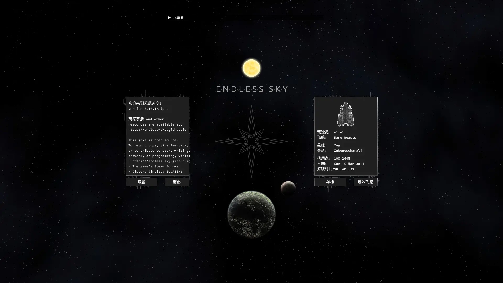
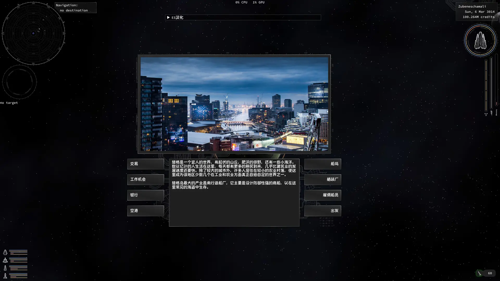
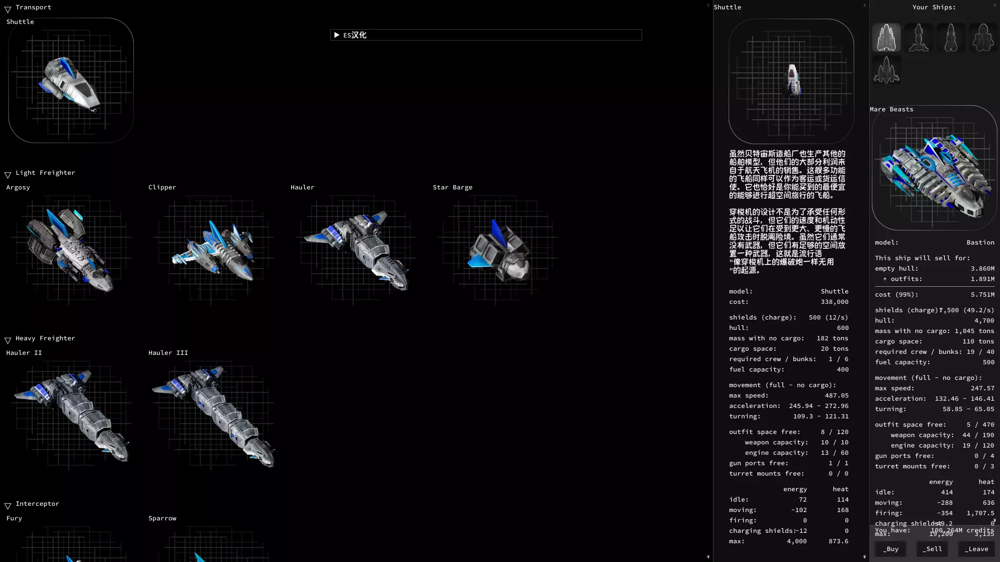

# Endless Sky
探索其他星系。通过交易、载客或完成任务来赚钱。用你的收入购买更好的飞船或升级你现有飞船上的武器和引擎。炸毁海盗。在一场内战中站队。或者离开人类空间，希望找到一些友好的外星人，他们的文化比你自己的更文明......

《无尽的天空》是一款沙盒式的太空探索游戏，类似于《精英》、《逃生速度》或《星际控制》。你一开始是一个小飞船的船长，可以选择以后做什么。游戏包括一条主要的情节线和许多次要的任务，但你可以选择是通过情节来玩，还是作为一个商人或赏金猎人或探险家独自出击。

# Licensing
Endless Sky is a free, open source game. The [source code](https://github.com/endless-sky/endless-sky/) is available under the GPL v3 license, and all the artwork is either public domain or released under a variety of Creative Commons (and similarly permissive) licenses. (To determine the copyright status of any of the artwork, consult the [copyright file](https://github.com/endless-sky/endless-sky/blob/master/copyright).)

# neoe changes

## 1 log invade
显然，ES不是一个无脑射击的游戏。因为我才玩就发现台词是有文采的，读起来也很有意思。前提是你的英语
必须要达到8级以上。我已经放弃了精通外语的野心。

所以第一个修改点是把台词输出到log文件里，然后手工用我刚发现的翻译质量不错的 https://www.deepl.com/translator 来翻译一下。

下一个也许是汉化，有前人做了少量的工作。首先我要玩一下是否好玩。只有对自己来说好玩的游戏才会去汉化的。

## 2 引擎汉化 + 优质机器翻译，覆盖率90%以上，翻译英文字母 3,700,000+
个别地方还需要微调。

